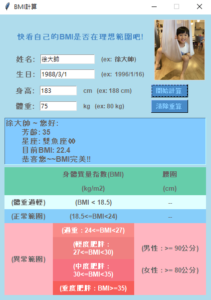

# 這是一BMI產生器
### 只要輸入正確格式的生日、身高、體重
### 即可算出您的BMI

#### 另外還有年齡、星座喔!!

---
這次主要是增加了
- 照片
- 年齡
- 星座
- 使用者無法調整視窗大小
---

### 疑問
呼叫function時，什麼時候需要加()?
### 解答

呼叫function say_hello不用加()
定義(註冊) function 要加()

- 強制push上github
- git push -f

- before push, need to do "add" first and then "commit"
- 1. add ($ git add .)
- 2. commit ($ git commit -m "第n次修改" )